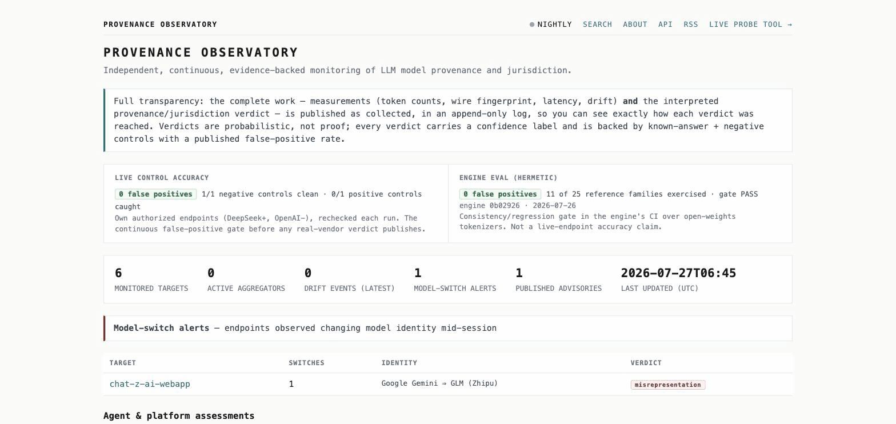

<div align="center">

# 🔭 Provenance Observatory

### Public, continuous, evidence-backed monitoring of *what actually serves* a given LLM API endpoint — and whether it's **Chinese-origin** or **PRC-jurisdiction**.

AI vendors can quietly change which model answers your API calls. The Observatory checks a watch list **every night, in public, and keeps the receipts**: a cosign/Rekor-signed, append-only evidence log, per-target drift timelines, and numbered advisories a compliance team can cite.

**[🌐 View the live Observatory →](https://lobster-shrimp.github.io/provenance-observatory/)**


[](https://lobster-shrimp.github.io/provenance-observatory/)

*The live site: full-transparency banner, live control accuracy (0 false positives), and the `chat-z-ai-webapp` model-switch alert (Google Gemini persona → GLM/Zhipu).*

</div>

Built on **[provenance-probe](https://github.com/lobster-shrimp/provenance-probe)** as a black-box CLI dependency — same fingerprinting engine, wrapped in everything a *continuous public* service needs.


*The engine underneath: it fingerprints `northstar-secure-1` as Qwen2 (Chinese-origin). The Observatory runs this nightly and publishes the receipts.*

---

## 🤔 The problem

A vendor can swap in a cheaper model, reroute your requests, or resell a Chinese-made model under a Western name — and you'd normally never know. A one-time check helps; a **signed public record over time** is what compliance and procurement teams can actually cite. This is that record: verdicts with confidence levels and a measured error rate, not a rumor mill.

## ✨ What it does

Nightly, it probes a watch list and commits results to git as an **append-only, tamper-evident log** (Certificate Transparency for model provenance, anchored in [Rekor](https://www.sigstore.dev/)). Everything is published **in full, as collected** — the measurements *and* the interpreted verdict — so you can see exactly how each verdict was reached. Accuracy comes from transparency plus safeguards, not withholding:

- ✅ Known-answer + negative **controls** with a published false-positive rate
- 🏷️ A **confidence label** on every verdict (probabilistic, never "proof")
- 📝 Prominent **corrections/retractions** — an operator or reader can dispute; wrong verdicts are retracted in the same signed log
- 🚧 A **publication policy** the signer enforces ([`lib/publish_policy.py`](lib/publish_policy.py)): a proxy (`via_omniroute`) measurement is not certified without a passing calibration + routing disclosure, and a router-vs-fingerprint **CONTRADICTED** cross-check is **quarantined for human review, never auto-published**. Quarantined records are excluded from the signed manifest and shown, with the reason, in the transparency log — see [`docs/ARCHITECTURE.md`](docs/ARCHITECTURE.md#publication-policy--what-the-signer-certifies-p2b).

It surfaces the evidence three ways:

- **🌐 A public site** — a dense verdict table with search / filter / pagination, per-target drift timelines, an assurance panel (live control FP rate + the engine's hermetic eval), a **catalog** page (searchable running table of Chinese-origin inference APIs × models × model-card facts), a transparency log with Rekor inclusion links, methodology / FAQ / verify pages, and RSS.
- **🔌 A JSON API** (`api/`, FastAPI) — `/api/verdicts`, `/api/targets/{name}`, `/api/advisories`, `/api/manifests`, `/api/model-changes`, `/api/status`, `/api/search`, **`/api/registry`** (signed provider attribution), **`/api/catalog`** (signed LLM-API catalog), an SSE stream, and auto OpenAPI at `/api/docs`.
- **📋 Numbered advisories** (MPA-YYYY-NNN) practitioners can cite in ATO packages and procurement memos.

**🔀 Model-switch detection.** Beyond day-over-day drift, it catches a served model changing identity mid-run (`session_boundary`) and ingests captured session transcripts to surface mid-session identity flips — e.g. the live site's `chat-z-ai-webapp` alert: **Google Gemini persona → GLM (Zhipu)**, flagged as a misrepresentation.

**🤖 Continuous agent monitoring.** A target with an `agent_trace` is assessed nightly by the engine's agent flight recorder; `runner/agent_monitor.py` fingerprints the agent's *model composition* and opens a numbered advisory when it drifts, routes differently, or egresses to a new jurisdiction.

## ⚡ Quick start (local dev)

<details open>
<summary><b>🍎 macOS / 🐧 Linux</b></summary>

```bash
git clone https://github.com/lobster-shrimp/provenance-observatory && cd provenance-observatory
python3 -m venv .venv && source .venv/bin/activate
pip install "provenance-probe" pyyaml pytest
pytest                                              # lib + site + advisory tests (121)
python site/build.py --data data --out site/dist   # render the site from committed evidence
```
</details>

<details>
<summary><b>🪟 Windows (PowerShell)</b></summary>

```powershell
git clone https://github.com/lobster-shrimp/provenance-observatory; cd provenance-observatory
py -3 -m venv .venv; .\.venv\Scripts\Activate.ps1
pip install llm-provenance-probe pyyaml pytest
pytest
python site\build.py --data data --out site\dist
```
</details>

**Run a probe cycle** (controls only by default — zero third-party ToS risk):

```bash
python runner/run.py --targets targets.yaml
```

Each run writes neutral evidence + a verdict to `data/<target>/<date>/verdict.json` and a signed daily manifest. Adding a monitored target (API or web app): [`docs/adding-targets.md`](docs/adding-targets.md).

## 🗂️ Layout

| Path | Role |
|---|---|
| `targets.yaml` | Watch list; `authorized` gates probing, spend budget. → [`docs/adding-targets.md`](docs/adding-targets.md) |
| `runner/run.py` | Nightly runner — probe, drift + session-boundary check (via the provenance-probe CLI) |
| `runner/advisory.py` · `promote.py` | Drift / model-switch → advisory → numbered public advisory (MPA-YYYY-NNN) |
| `runner/agent_monitor.py` | Continuous agent monitoring + agent advisories |
| `lib/verdict.py` · `records.py` · `signing.py` · `feed.py` | Record assembly, canonical readers, cosign/Rekor signing, RSS |
| `api/` | Live JSON API (FastAPI). See [`api/README.md`](api/README.md) + [`api/DEPLOY.md`](api/DEPLOY.md) |
| `site/build.py` | Static site renderer |
| `.github/workflows/observatory.yml` | Nightly cron: probe → ingest → sign → commit → **deploy to Pages** |

## 🔗 Relationship to provenance-probe

This repo contains **no fingerprinting logic** — that lives in **[provenance-probe](https://github.com/lobster-shrimp/provenance-probe)** (engine + CLI + local UI). The Observatory consumes it as a black-box CLI (`assess`, `monitor`'s exit-2 drift contract, `fingerprint_id`) and adds scheduling, the signed evidence log, advisories, the API, and the site.

| | provenance-probe | provenance-observatory (this repo) |
|---|---|---|
| Role | Engine + CLI + local web UI | GitHub-native monitoring service |
| Use | Point-in-time, any authorized endpoint | Nightly monitoring of a curated watch list |
| Output | Console + JSON/HTML report | Signed evidence log + public site + advisories |

## 📚 More

- **[Whitepaper](https://github.com/lobster-shrimp/provenance-probe/blob/main/WHITEPAPER.md)** — problem, method, open-source rationale.
- **[docs/ARCHITECTURE.md](docs/ARCHITECTURE.md)** — the full decision record.
- **[DISCLOSURE.md](DISCLOSURE.md)** — the full-transparency publication policy.
- **Probe randomization** — set `OBSERVATORY_VARIANT_SEED=N` to rotate the on-wire probe bytes (defeats exact-string special-casing); rebuild the engine reference for the same seed.
